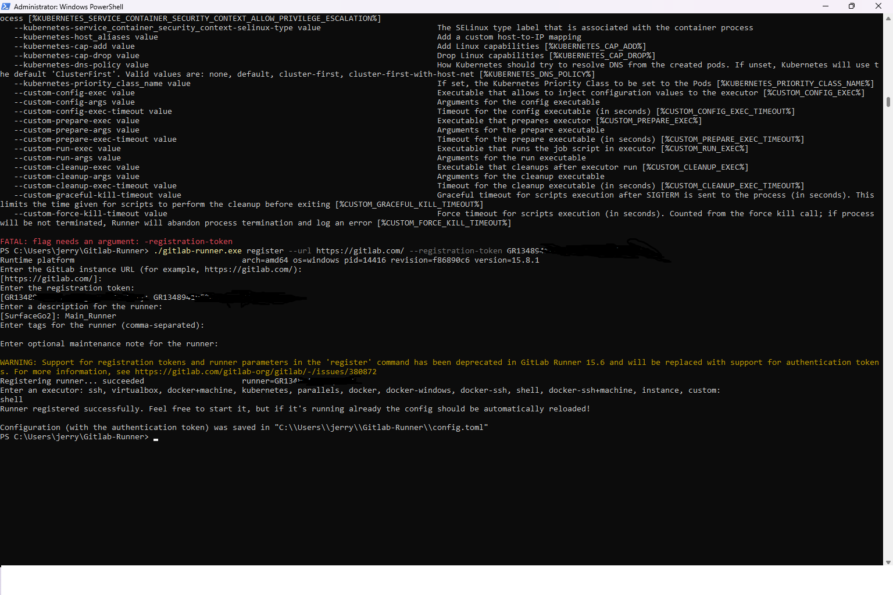
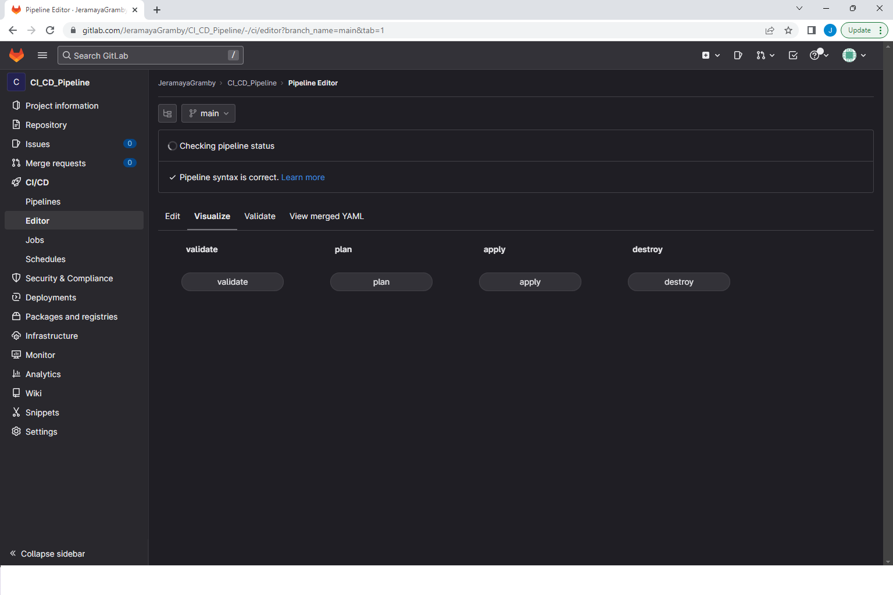

 

## This README file contains:
-Overview of the project  
-Use cases for the pipeline 
-Project Weaknesses
-Project Photos  

## Project Overview
This CI/CD project deploys AWS infrastructure in Terraform using Gitlab automation. It deploys an Auto-Scaling Group with a desired and minimum capacity of 2 instances and a maximum capacity of 3 instances. It also deploys a security group, shared between both instances, allowing outbound internet traffic and inbound traffic from port 22 and 80.  

Before creation of the pipeline, I utilized the AWS CLI to create a new S3 bucket to save the Terraform state file.  
 

When accessing the EC2 instances through the public IPV4 address they run a simple PHP script that displays a webpage informing the user that the CI/CD pipeline is operational.   

When changes are made on Terraform, it automatically provisions these changes when the pipeline is ran in Gitlab and saves the changes to a state file on an S3 bucket.   

## Use Cases
This project will function as a template for deploying AWS infrastructure and saving those changes on S3 buckets.   

## Project Weaknesses
  

## Project Photos   

